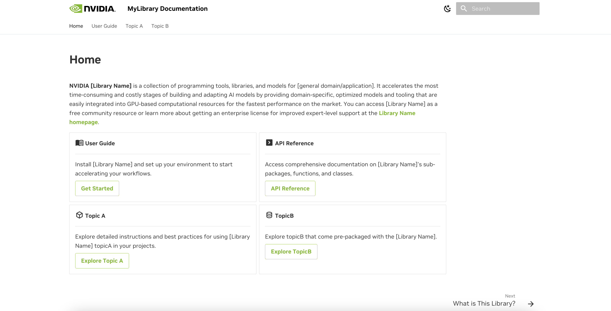

# nvidia-mkdocs-material-starter

This is a start for building documentation using [Material for MkDocs](https://squidfunk.github.io/mkdocs-material/). It includes NVIDIA themes, colors (light & dark mode), and icons:



See a live version for BioNeMo documentation [here](https://docs.nvidia.com/bionemo-framework/latest/).

Note, this is just a starter repository. It does not include our automated build scripts or file content.

Make sure you have docker running

E.g. on mac:

```
colima start
```

Then, build the image:

```
docker build -t mkdocs-nvidia .
```

To launch run the container, then navigate to the listed port, [http://0.0.0.0:8000/](http://0.0.0.0:8000/):

```
docker run --rm -it -p 8000:8000 -v ${PWD}:/docs mkdocs-nvidia
```
