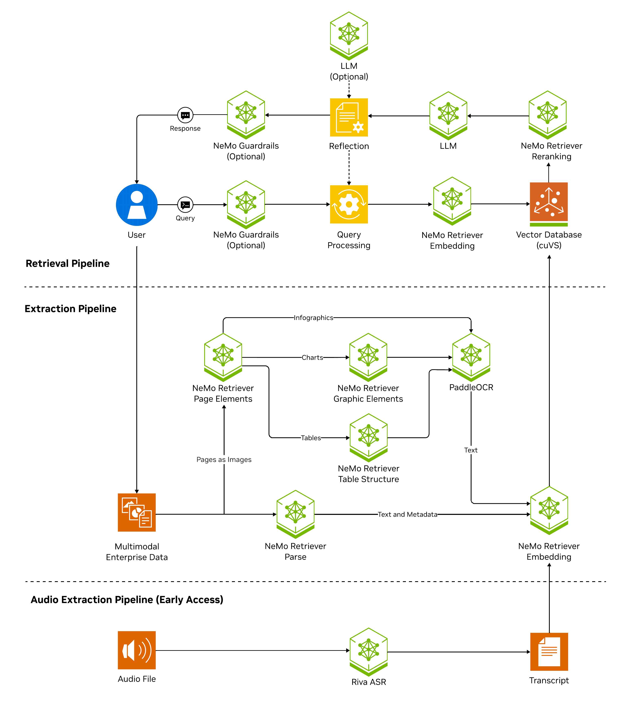

# Extract Speech with NeMo Retriever Library

This documentation describes two methods to run [NeMo Retriever Library](overview.md) 
with the [RIVA ASR NIM microservice](https://docs.nvidia.com/deeplearning/riva/user-guide/docs/index.html) 
to extract speech from audio files.

- Run the NIM locally by using Docker Compose
- Use NVIDIA Cloud Functions (NVCF) endpoints for cloud-based inference

!!! note

    NVIDIA Ingest and nv-ingest is now known as the NeMo Retriever Library.

Currently, you can extract speech from the following file types:

- `mp3`
- `wav`


## Overview

[NeMo Retriever Library](overview.md) supports extracting speech from audio files for Retrieval Augmented Generation (RAG) applications. 
Similar to how the multimodal document extraction pipeline leverages object detection and image OCR microservices, 
NeMo Retriever Library leverages the [RIVA ASR NIM microservice](https://docs.nvidia.com/deeplearning/riva/user-guide/docs/index.html) 
to transcribe speech to text, which is then embedded by using the Nemotron embedding NIM. 

!!! important

    Due to limitations in available VRAM controls in the current release, the RIVA ASR NIM microservice must run on a [dedicated additional GPU](support-matrix.md). For the full list of requirements, refer to [Support Matrix](https://docs.nvidia.com/deeplearning/riva/user-guide/docs/support-matrix.html).

This pipeline enables users to retrieve speech files at the segment level.





## Run the NIM Locally by Using Docker Compose

Use the following procedure to run the NIM locally.

!!! important

    The RIVA ASR NIM microservice must run on a [dedicated additional GPU](support-matrix.md). Edit docker-compose.yaml to set the device_id to a dedicated GPU: device_ids: ["1"] or higher.

1. To access the required container images, log in to the NVIDIA Container Registry (nvcr.io). Use [your NGC key](ngc-api-key.md) as the password. Run the following command in your terminal.

    - Replace `<your-ngc-key>` with your actual NGC API key.
    - The username is always `$oauthtoken`.

    ```shell
    $ docker login nvcr.io
    Username: $oauthtoken
    Password: <your-ngc-key>
    ```

2. For convenience and security, store [your NGC key](ngc-api-key.md) in an environment variable file (`.env`). This enables services to access it without needing to enter the key manually each time. Create a .env file in your working directory and add the following line. Replace `<your-ngc-key>` with your actual NGC key.

    ```ini
    NGC_API_KEY=<your-ngc-key>
    ```

3. Start the NeMo Retriever Library services with the `audio` profile. This profile includes the necessary components for audio processing. Use the following command. The `--profile audio` flag ensures that speech-specific services are launched. For more information, refer to [Profile Information](quickstart-guide.md#profile-information).

    ```shell
    docker compose --profile retrieval --profile audio up
    ```

4. After the services are running, you can interact with NeMo Retriever Library by using Python.

    - The `Ingestor` object initializes the ingestion process.
    - The `files` method specifies the input files to process.
    - The `extract` method tells NeMo Retriever Library to extract information from WAV audio files.
    - The `document_type` parameter is optional, because `Ingestor` should detect the file type automatically.

    ```python
    ingestor = (
        Ingestor()
        .files("./data/*.wav")
        .extract(
            document_type="wav",  # Ingestor should detect type automatically in most cases
            extract_method="audio",
        )
    )
    ```


    !!! tip

        For more Python examples, refer to [NeMo Retriever Library: Python Client Quick Start Guide](https://github.com/NVIDIA/NeMo-Retriever/blob/main/client/client_examples/examples/python_client_usage.ipynb).


## Use NVCF Endpoints for Cloud-Based Inference

Instead of running NeMo Retriever Library locally, you can use NVCF to perform inference by using remote endpoints.

1. NVCF requires an authentication token and a function ID for access. Ensure you have these credentials ready before making API calls.

2. Run inference by using Python. Provide an NVCF endpoint along with authentication details.

    - The `Ingestor` object initializes the ingestion process.
    - The `files` method specifies the input files to process.
    - The `extract` method tells NeMo Retriever Library to extract information from WAV audio files.
    - The `document_type` parameter is optional, because `Ingestor` should detect the file type automatically.

    ```python
    ingestor = (
        Ingestor()
        .files("./data/*.mp3")
        .extract(
            document_type="mp3",
            extract_method="audio",
            extract_audio_params={
                "grpc_endpoint": "grpc.nvcf.nvidia.com:443",
                "auth_token": "<API key>",
                "function_id": "<function ID>",
                "use_ssl": True,
            },
        )
    )
    ```

    !!! tip

        For more Python examples, refer to [NeMo Retriever Library: Python Client Quick Start Guide](https://github.com/NVIDIA/NeMo-Retriever/blob/main/client/client_examples/examples/python_client_usage.ipynb).


## Related Topics

- [Support Matrix](support-matrix.md)
- [Troubleshoot NeMo Retriever Library](troubleshoot.md)
- [Use the NeMo Retriever Library Python API](python-api-reference.md)
