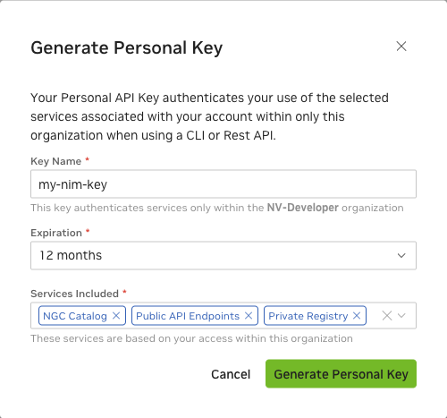

# Generate Your NGC Keys

NGC contains many public images, models, and datasets that can be pulled immediately without authentication. 
To push and pull custom images, you must generate a key and authenticate with NGC.

To create a key, go to [https://org.ngc.nvidia.com/setup/api-keys](https://org.ngc.nvidia.com/setup/api-keys).

When you create an NGC key, select the following for **Services Included**.

- **NGC Catalog**
- **Public API Endpoints**

!!! important

    Early Access participants must also select **Private Registry**.




## Docker Login to NGC

To pull the NIM container image from NGC, use your key to log in to the NGC registry by entering the following command and then following the prompts. 
For the username, enter `$oauthtoken` exactly as shown. 
It is a special authentication key for all users.


```shell
$ docker login nvcr.io
Username: $oauthtoken
Password: <Your Key>
```
