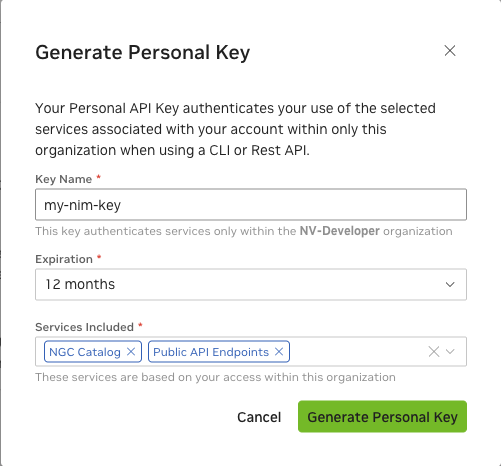

# Generate Your NGC Keys

## Generate an API key

NGC contains many public images, models, and datasets that can be pulled immediately without authentication.
To push and pull custom images to and from the private registry, you must authenticate with NGC and generate a private key.

To create a private key, go to [https://org.ngc.nvidia.com/setup/personal-keys](https://org.ngc.nvidia.com/setup/personal-keys).

When creating an NGC API key, ensure that all of the following are selected from the "Services Included" drop-down.
- AI Foundation Models and Endpoints
- NGC Catalog
- Private Registry



### Docker Login to NGC

To pull the NIM container image from NGC, use your API key to log in to the NGC registry by entering the following command and following the prompts:
```shell
$ docker login nvcr.io
Username: $oauthtoken
Password: <Your Key>
```
For the username, enter '$oauthtoken' exactly as shown. It is a special authentication key for all users.
