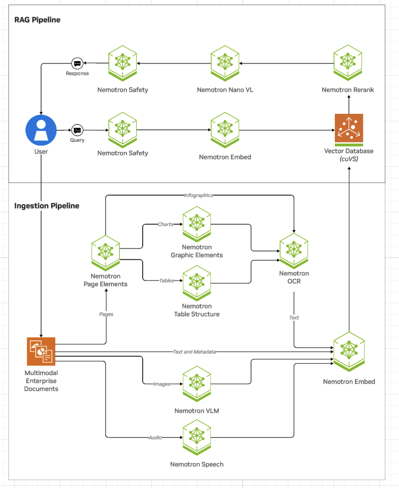

# What is NeMo Retriever Extraction?

NeMo Retriever extraction is a scalable, performance-oriented document content and metadata extraction microservice. 
NeMo Retriever extraction uses specialized NVIDIA NIM microservices 
to find, contextualize, and extract text, tables, charts and images that you can use in downstream generative applications.

!!! note

    NeMo Retriever extraction is also known as NVIDIA Ingest and nv-ingest.

NeMo Retriever extraction enables parallelization of splitting documents into pages where artifacts are classified (such as text, tables, charts, and images), extracted, and further contextualized through optical character recognition (OCR) into a well defined JSON schema. 
From there, NeMo Retriever extraction can optionally manage computation of embeddings for the extracted content, 
and optionally manage storing into a vector database [Milvus](https://milvus.io/).

!!! note

    Cached and Deplot are deprecated. Instead, docker-compose now uses a beta version of the yolox-graphic-elements container. With this change, you should now be able to run nv-ingest on a single 80GB A100 or H100 GPU. If you want to use the old pipeline, with Cached and Deplot, use the [nv-ingest 24.12.1 release](https://github.com/NVIDIA/nv-ingest/tree/24.12.1).

## What NeMo Retriever Extraction Is ✔️

NeMo Retriever extraction is a microservice service that does the following:

- Accept a JSON job description, containing a document payload, and a set of ingestion tasks to perform on that payload.
- Allow the results of a job to be retrieved. The result is a JSON dictionary that contains a list of metadata describing objects extracted from the base document, and processing annotations and timing/trace data.
- Support multiple methods of extraction for each document type to balance trade-offs between throughput and accuracy. For example, for .pdf documents, we support extraction through pdfium, Unstructured.io, and Adobe Content Extraction Services.
- Support various types of pre- and post- processing operations, including text splitting and chunking, transform and filtering, embedding generation, and image offloading to storage.

NeMo Retriever extraction supports the following file types:

- `pdf`
- `docx`
- `pptx`
- `jpeg`
- `png`
- `svg`
- `tiff`
- `txt`

## What NeMo Retriever Extraction Isn't ✖️

NeMo Retriever extraction does not do the following:

- Run a static pipeline or fixed set of operations on every submitted document.
- Act as a wrapper for any specific document parsing library.

## Related Topics

- [Prerequisites](prerequisites.md)
- [Support Matrix](support-matrix.md)
- [Quickstart (Library Mode)](quickstart-library-mode.md)
- [Quickstart (Self-Hosted)](quickstart-guide.md)
- [Notebooks](notebooks.md)
- [Multimodal PDF Data Extraction](https://build.nvidia.com/nvidia/multimodal-pdf-data-extraction-for-enterprise-rag)
