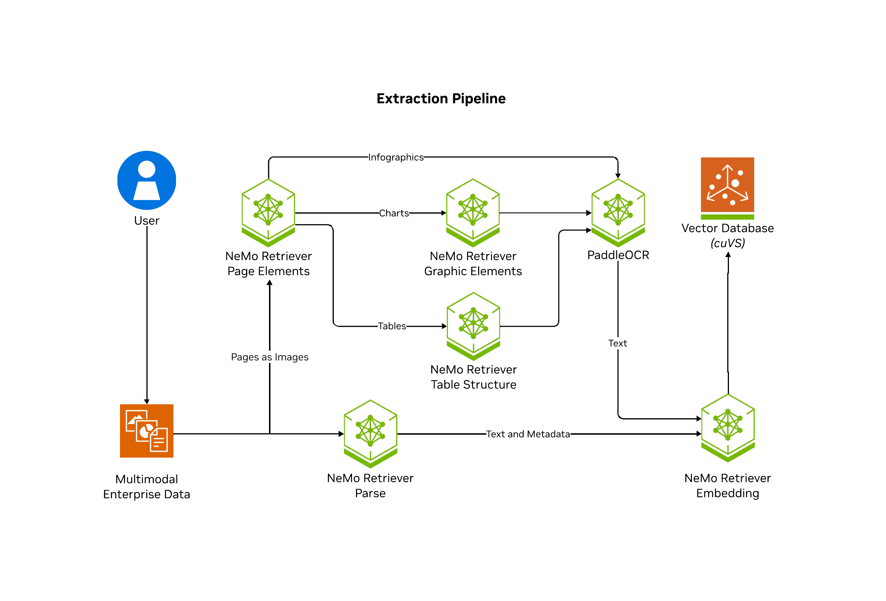

# What is NeMo Retriever Library?

NeMo Retriever Library is a scalable, performance-oriented document content and metadata extraction microservice. 
NeMo Retriever Library uses specialized NVIDIA NIM microservices 
to find, contextualize, and extract text, tables, charts and infographics that you can use in downstream generative applications.

!!! note

    This library is the NeMo Retriever Library.

NeMo Retriever Library enables parallelization of splitting documents into pages where artifacts are classified (such as text, tables, charts, and infographics), extracted, and further contextualized through optical character recognition (OCR) into a well defined JSON schema. 
From there, NeMo Retriever Library can optionally manage computation of embeddings for the extracted content, 
and optionally manage storing into a vector database [Milvus](https://milvus.io/).

!!! note

    Cached and Deplot are deprecated. Instead, NeMo Retriever Library now uses the yolox-graphic-elements NIM. With this change, you should now be able to run NeMo Retriever Library on a single 24GB A10G or better GPU. If you want to use the old pipeline, with Cached and Deplot, use the [NeMo Retriever Library 24.12.1 release](https://github.com/NVIDIA/NeMo-Retriever/tree/24.12.1).

## What NeMo Retriever Library Is ✔️

The following diagram shows the NeMo Retriever Library pipeline.

NeMo Retriever Library is a microservice service that does the following:

- Accept a JSON job description, containing a document payload, and a set of ingestion tasks to perform on that payload.
- Allow the results of a job to be retrieved. The result is a JSON dictionary that contains a list of metadata describing objects extracted from the base document, and processing annotations and timing/trace data.
- Support multiple methods of extraction for each document type to balance trade-offs between throughput and accuracy. For example, for .pdf documents, extraction is performed by using pdfium, [nemotron-parse](https://build.nvidia.com/nvidia/nemotron-parse), Unstructured.io, and Adobe Content Extraction Services.
- Support various types of pre- and post- processing operations, including text splitting and chunking, transform and filtering, embedding generation, and image offloading to storage.

NeMo Retriever Library supports the following file types:

- `avi` (early access)
- `bmp`
- `docx`
- `html` (converted to markdown format)
- `jpeg`
- `json` (treated as text)
- `md` (treated as text)
- `mkv` (early access)
- `mov` (early access)
- `mp3`
- `mp4` (early access)
- `pdf`
- `png`
- `pptx`
- `sh` (treated as text)
- `tiff`
- `txt`
- `wav`

## What NeMo Retriever Library Isn't ✖️

NeMo Retriever Library does not do the following:

- Run a static pipeline or fixed set of operations on every submitted document.
- Act as a wrapper for any specific document parsing library.

## Related Topics

- [Prerequisites](prerequisites.md)
- [Support Matrix](support-matrix.md)
- [Deploy Without Containers (Library Mode)](quickstart-library-mode.md)
- [Deploy With Docker Compose (Self-Hosted)](quickstart-guide.md)
- [Deploy With Helm](helm.md)
- [Notebooks](notebooks.md)
- [Enterprise RAG Blueprint](https://build.nvidia.com/nvidia/multimodal-pdf-data-extraction-for-enterprise-rag)
