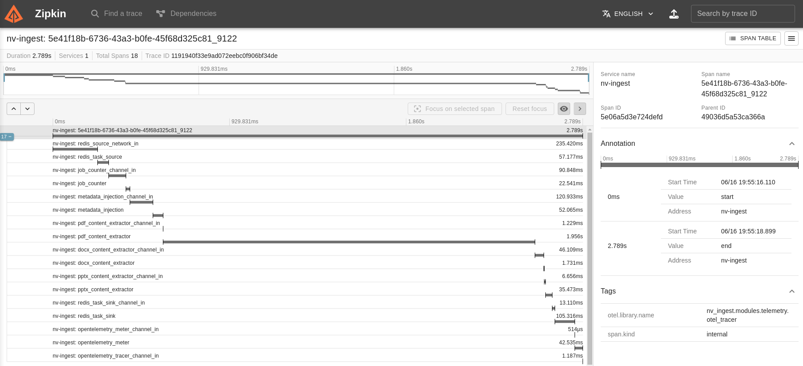
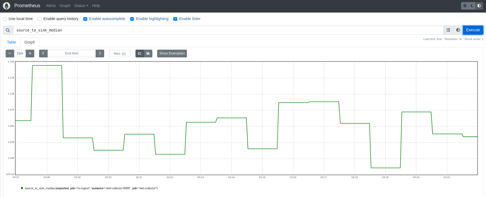

# Telemetry with NeMo Retriever Library

You can view telemetry data for [NeMo Retriever Library](overview.md).

!!! note

    This library is the NeMo Retriever Library.

## OpenTelemetry

After OpenTelemetry and Zipkin are running, you can open your browser to explore traces: 

- **Docker** — Use http://$YOUR_DOCKER_HOST:9411/zipkin/ 
- **Kubernetes** — Use http://$YOUR_K8S_OTEL_POD:9411/zipkin/

## Prometheus

After Prometheus is running, you can open your browser to explore metrics: 

- **Docker** — Use http://$YOUR_DOCKER_HOST:9090/zipkin/
- **Kubernetes** — Use http://$YOUR_K8S_OTEL_POD:9090/zipkin/

