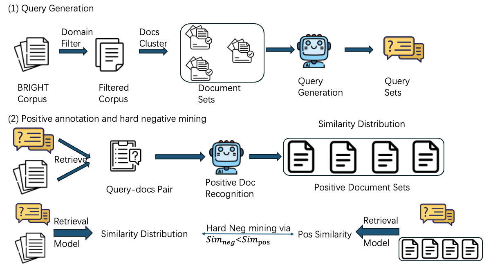

<h1 align="center">NVIDIA NeMo Retriever’s Agentic Retrieval Pipeline</h1>

<!-- <p align="center">
  <strong>A Pragmatic, Production-Grade Framework for Reasoning-Intensive Retrieval</strong>
</p> -->

<p align="center">
  <a href="https://brightbenchmark.github.io/"></a>
  <!-- <a href=""></a> -->
  <!-- <a href="https://github.com/yaoyichen/INF-X-Retriever"></a> -->
  <!-- <a href="https://opensource.org/licenses/Apache-2.0"></a> -->
</p>

<p align="center">
  <strong>NeMo Retriever's agentic retrieval pipeline</strong> is a high-performance agentic retrieval pipeline augmented with reasoning retriever developed by NVIDIA NeMo Retriever team. <br>
  It provides a strong and light solution for complex reasoning-intensive tasks with minimal supervision.
</p>

<p align="center">
  <a href="#introduction">Introduction</a> •
  <a href="#model-architecture">Architecture</a> •
  <a href="#synthetic-training-data-generation-for-nemo-retriever">Synthetic Data</a> •
  <a href="#nemo-retrievers-agentic-retrieval-pipeline">Agentic Pipeline</a> •
  <a href="#usage">Usage</a> •
  <a href="#performance">Performance</a> •
  <a href="#acknowledgement">Acknowledgement</a>
</p>

<a id="introduction"></a>
## 📖 Introduction

With the rapid development of large language models (LLMs), AI agents are able to handle increasingly complex tasks, and the paradigm of information retrieval has evolved accordingly. The BRIGHT benchmark introduces reasoning-intensive retrieval tasks, in which the queries require explicit reasoning to identify the correct documents. This benchmark moves beyond surface-level keyword matching and shifts toward complex intent-aware matching.

NeMo Retriever's agentic retrieval pipeline addresses this challenge through agentic retrieval and by designing a retrieval model specifically tailored for reasoning-oriented tasks, introducing innovations in both reasoning and retrieval. Our method achieves second place on the BRIGHT benchmark, demonstrating its effectiveness and generalizability while achieving strong performance on this benchmark.

<a id="model-architecture"></a>
## 🛠️ Model Architecture

The framework is built around two highly independent, custom-designed modules.

### 1. Retriever Model
* **Model**: [llama-nv-embed-reasoning-3b](https://huggingface.co/nvidia/llama-nv-embed-reasoning-3b)
* **Backbone**: LLaMA-3.2-3B (non-instruct, fine-tuned via InfoNCE loss)  
* **Function**: As a dense retriever, it is trained on large-scale LLM-generated synthetic data, aiming to align queries with documents that do not rely on keyword overlap by bringing them closer in the representation space.

### 2. Agentic retrieval pipeline
* **Model**: [pipeline](https://github.com/NVIDIA/NeMo-Retriever/tree/main/retrieval-bench#agentic-retrieval) with Claude Opus 4.5
* **Principle**: Built around a commercial LLM, we develop an agentic RAG framework that uses carefully designed prompts to guide the LLM through multi-step retrieval and reasoning. The framework iteratively retrieves and answers sub-questions, then summarizes the retrieved evidence and selects the top-k documents to support answering the main query.

<a id="synthetic-training-data-generation-for-nemo-retriever"></a>
## 📦 Synthetic Training Data Generation for NeMo Retriever

<p align="center">
  
</p>

The data synthesis pipeline constructs high-quality query–document training data through LLM-driven query generation and retrieval-based positive and hard negative selection.

(1) **Query Generation.**
Starting from a large raw corpus (e.g., the BRIGHT corpus), a domain-specific filter is applied to obtain a set of relevant documents. In addition, to ensure that no test-set documents are leaked, we explicitly filtered out all positive documents associated with the test sets during the question generation process. Each filtered document is treated as an anchor document and used to retrieve its top-4 most similar documents from the corpus using a retrieval model ([*reason-embed-basic-qwen3-4b-0928*](https://huggingface.co/hanhainebula/reason-embed-basic-qwen3-4b-0928)). The anchor document together with its retrieved neighbors forms a document set. Conditioned on each document set, we use an LLM ([*Qwen3-235B-A22B*](https://huggingface.co/Qwen/Qwen3-235B-A22B)) to generate natural language queries of at most 300 tokens. The model is instructed to generate reasoning-intensive questions, such that answering the question requires non-trivial reasoning and is necessary to leverage the associated documents.

(2) **Positive Annotation and Hard Negative Mining.**
Given the generated queries, query–document pairs are constructed by pairing each query with documents from the corpus. An LLM ([*Qwen3-next-80b-a3b-instruct*](https://huggingface.co/Qwen/Qwen3-Next-80B-A3B-Instruct)) is used to identify documents that genuinely support or answer the query, yielding a set of positive documents and their similarity distribution. To further improve training quality, hard negatives are mined using a retrieval model ([*reason-embed-basic-qwen3-4b-0928*](https://huggingface.co/hanhainebula/reason-embed-basic-qwen3-4b-0928)). For each query, documents are retrieved based on embedding similarity, and those with similarity scores slightly lower than the positives (i.e., $\text{Sim}_{neg} < \text{Sim}_{pos}$) are selected as hard negatives. This criterion ensures that negatives remain semantically close to the query while avoiding false positives.

After generating our synthetic data, we additionally incorporate the training sets from [ReasonEmbed](https://arxiv.org/abs/2510.08252), [ReasonAug](https://arxiv.org/abs/2505.15045), and [ReasonRank](https://arxiv.org/abs/2508.07050) to further train the retriever. In particular, based on empirical performance, we selected data from the following domains for training:

- From **ReasonEmbed**: *biology*, *earth_science*, *economics*, *psychology*, *robotics*, *sustainable_living*, *stackoverflow*, *pony*, *theoremqa_questions*, and *theoremqa_theorems*.
- From **ReasonAug**: *math* and *theorem*.
- From **ReasonRank**: *biology*, *stackoverflow*, *math-qa*, *math-theorem*, *earth_science*, and *robotics*.


<a id="nemo-retrievers-agentic-retrieval-pipeline"></a>
## 🤖 NeMo Retriever’s agentic retrieval pipeline

### The Agentic Loop
Our agentic retrieval pipeline relies on a ReACT architecture. Instead of a single "one-and-done" query, the agent iteratively searches, evaluates, and refines its approach. The agent utilizes built-in tools like `think` to plan its approach and `final_results` to output the exact documents needed, alongside a `retrieve(query, top_k)` tool to explore the corpus. Through this loop, we observed successful search patterns emerge naturally:
- Generating better queries: The agent dynamically adjusts its search queries based on newly discovered information.
- Persistent rephrasing: It continually rephrases queries until useful information is found.
- Breaking down complexity: It translates complex, multi-part queries into multiple simpler queries with clear goals.

Finally, the agent calls a `final_results` tool to output the most relevant documents. As a safety net—for example, when the agent hits the maximum number of steps or the context length limit—the pipeline falls back to Reciprocal Rank Fusion (RRF), which scores documents based on their ranks across all retrieval attempts in the agent trajectory.

### Engineering for Speed and Scale
Agentic workflows are notoriously slow. Initially, we used a Model Context Protocol (MCP) server to connect the retriever and the agent, but this architecture imposed a heavy "performance tax." The overhead of managing separate processes, loading GPU-resident embeddings for every run, and handling network latency created significant bottlenecks and frequent server freezes. To resolve this, we replaced the MCP server with a thread-safe singleton retriever that lives in-process.

By loading the model and corpus once and protecting access with a reentrant lock, we achieved safe, shared GPU access without network serialization overhead. This single change eliminated deployment errors and dramatically improved both GPU utilization and experiment throughput.

<a id="usage"></a>
## 🚀 Usage
To reproduce our results on BRIGHT, follow the [installation instructions](https://github.com/NVIDIA/NeMo-Retriever/tree/main/retrieval-bench), then run the following command:

```bash
retrieval-bench evaluate agentic-retrieval \
        --dataset-name bright/biology \
        --backend llama-embed-nemotron-reasoning-3b \
        --llm-model openai/aws/anthropic/claude-opus-4-5 \
        --num-concurrent 1
```
You can specify BRIGHT task names via `--dataset-name`. By default, the pipeline reads `OPENAI_API_KEY` and `OPENAI_BASE_URL` from environment variables; override these via `--pipeline-args`:
```bash
retrieval-bench evaluate agentic-retrieval \
  --dataset-name bright/biology \
  --backend llama-nv-embed-reasoning-3b \
  --llm-model your-llm-model \
  --pipeline-args '{"api_key":"os.environ/MY_KEY","base_url":"os.environ/MY_URL"}'
```

<a id="performance"></a>
## 📊 Performance

**BRIGHT** is a benchmark for reasoning-intensive information retrieval, where determining the relevance between a query and a document goes beyond lexical or semantic matching and requires deliberate, multi-step reasoning. It covers diverse and advanced domains such as economics, mathematics, programming, and natural sciences, with queries drawn from real human data and carefully curated sources. In BRIGHT, relevant documents often share underlying principles, theories, or algorithms with the query rather than surface-level similarity. As a result, state-of-the-art retrievers that perform well on traditional benchmarks like BEIR and MTEB show substantial performance drops on BRIGHT, highlighting its difficulty and its role in evaluating and advancing retrieval models with genuine reasoning capabilities.

### Short document in BRIGHT 

####  Results (nDCG@10) Across 12 Datasets for the NeMo Retriever’s agentic retrieval pipeline

| Model | Avg | Bio. | Earth. | Econ. | Psy. | Rob. | Stack. | Sus. | Leet. | Pony | AoPS | TheoQ. | TheoT. |
| :--- | :---: | :---: | :---: | :---: | :---: | :---: | :---: | :---: | :---: | :---: | :---: | :---: | :---: |
| INF-X-Retriever | 63.4 | 79.8 | 70.9 | 69.9 | 73.3 | 57.7 | 64.3 | 61.9 | 56.1 | 54.5 | 51.9 | 53.1 | 67.9 |
| **NeMo Retriever's Agentic Pipeline** | **50.9** | **72.8** | **66.0** | **48.7** | **59.6** | **52.5** | **47.1** | **50.2** | **49.3** | **42.1** | **21.0** | **53.3** | **48.0** |
| DIVER (v3) | 46.8 | 66.0 | 63.7 | 42.4 | 55.0 | 40.6 | 44.7 | 50.4 | 32.5 | 47.3 | 17.2 | 46.4 | 55.6 |
| BGE-Reasoner-0928* | 46.4 | 68.5 | 66.4 | 40.6 | 53.1 | 43.2 | 44.1 | 47.8 | 29.0 | 41.6 | 17.2 | 46.5 | 58.4 |
| LATTICE | 42.1 | 64.4 | 62.4 | 45.4 | 57.4 | 47.6 | 37.6 | 46.4 | 19.9 | 34.0 | 12.0 | 30.1 | 47.8 |
| ReasonRank | 40.8 | 62.7 | 55.5 | 36.7 | 54.6 | 35.7 | 38.0 | 44.8 | 29.5 | 25.6 | 14.4 | 42.0 | 50.1 |
| XDR2 | 40.3 | 63.1 | 55.4 | 38.5 | 52.9 | 37.1 | 38.2 | 44.6 | 21.9 | 35.0 | 15.7 | 34.4 | 46.2 |

####  Results (nDCG@10) Across 12 Datasets for the llama-nv-embed-reasoning-3b model

| Model | Avg | Bio. | Earth. | Econ. | Psy. | Rob. | Stack. | Sus. | Leet. | Pony | AoPS | TheoQ. | TheoT. |
| :--- | :---: | :---: | :---: | :---: | :---: | :---: | :---: | :---: | :---: | :---: | :---: | :---: | :---: |
|**llama-nv-embed-reasoning-3b**| **38.3**| **63.4**|**60.2**|	**39.5** |	**45.5**|**32.6**|**34.0**|	**43.3** |**37.5**|**15.0**|**10.5**|**39.5**|**38.5**|
| ReasonEmbed-Qwen3-8B (Redapter) | 38.1 | 55.5 |56.6 |36.2 |47.4 | 35.3 |36.6 |39.1| 33.6| 16.4 |12.5 |41.4| 47.2 |
| ReasonEmbed-Qwen3-4B (Redapter) |37.1| 55.4| 54.5 |34.9 |46.9| 34.0 |36.1 |37.4|  34.5| 13.6 | 11.3 |41.4 |45.1 |
| ReasonEmbed-Llama-3.1-8B (Redapter) |36.2| 55.4| 56.2 |35.2| 48.5 |32.1| 37.3 | 41.1 |28.8| 16.8 |9.1 |37.9 |36.6|
| DIVER-Retriever | 28.9 | 41.8| 43.7 |21.7| 35.3 |21.0| 21.2| 25.1 |37.6 |13.2| 10.7 |38.4| 37.3|
| Seed-1.5-Embedding | 27.2 | 34.8| 46.9 |23.4| 31.6 |19.1 |25.4 |21.0 |43.2| 4.9 |12.2| 33.3| 30.5|
| RaDeR-gte-Qwen2-7B | 25.5 | 34.6 | 38.9 | 22.1 | 33.0 | 14.8 | 22.5 | 23.7 | 37.3 | 5.0 | 10.2 | 28.4 | 35.1 |
| ReasonIR-8B | 24.4 | 26.2 | 31.4 | 23.3 | 30.0 | 18.0 | 23.9 | 20.5 | 35.0 | 10.5 | 14.7| 31.9 | 27.2 |
| Qwen3-Embedding-8B | 22.8 | 21.0 | 33.0 | 18.4 | 26.1 | 15.7 | 19.4 | 17.3 | 33.8 | 1.2 | 9.4 | 39.2 | 39.3 |
| llama-nemotron-embed-3b-v2 |22.3| 31.1|36.7	|22.3	|28.4	|18.0|	18.4|	20.3|	32.1	|6.8|	12.1	|25.1	|16.5	|
| Qwen3-Embedding-4B | 21.8 | 17.8 | 34.7 | 16.9 | 23.3 | 12.5 | 16.2 | 16.8 | 35.7 | 1.4 | 9.8 | 35.5 | 41.5 |
| BM25 | 14.5 | 18.9 | 27.2 | 14.9 | 12.5 | 13.6 | 18.4 | 15.0 | 24.4 | 7.9 | 6.2 | 10.4 | 4.9 |

<a id="acknowledgement"></a>
## ✨ Acknowledgement
This pipeline is based on work done by [Jie He](https://probe2.github.io/) (retriever model) and [Reza Esfandiarpoor](https://reza.website/) (agentic pipeline) during their internships at NVIDIA.
