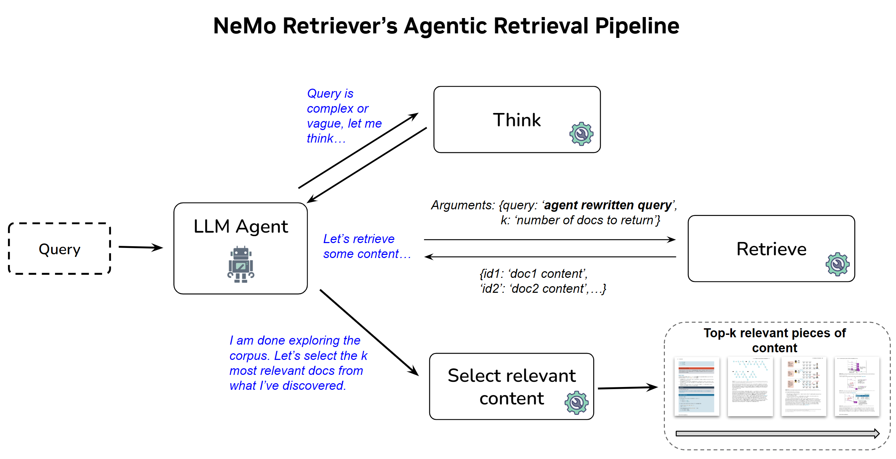

<h1 align="center">NVIDIA NeMo Retriever’s Agentic Retrieval Pipeline - ViDoRe V3 Pipeline benchmark</h1>

<!-- <p align="center">
  <strong>A Pragmatic, Production-Grade Framework for Reasoning-Intensive Retrieval</strong>
</p> -->

<p align="center">
  <a href="https://mteb-leaderboard.hf.space/?benchmark_name=ViDoRe%28v3%29"></a>
  <!-- <a href=""></a> -->
  <!-- <a href="https://github.com/yaoyichen/INF-X-Retriever"></a> -->
  <!-- <a href="https://opensource.org/licenses/Apache-2.0"></a> -->
</p>

<p align="center">
  <strong>NeMo Retriever's agentic retrieval pipeline</strong> is a generic implementation of an agentic system composed of an LLM agent with access to tools for retrieving content (images, text) using an embedding model and for selecting and reranking the top-k most relevant content among the retrieved pieces of information. It was developed by NVIDIA NeMo Retriever team. <br>
    In this page we describe the agentic retrieval pipeline and also its results for a high-quality pipeline benchmark on visual document retrieval: ViDoRe V3.
</p>


<p align="center">
  <a href="#introduction">Introduction</a> •
  <a href="#model-architecture">Architecture</a> •
  <a href="#nemo-retrievers-agentic-retrieval-pipeline">Agentic Pipeline</a> •
  <a href="#usage">Usage</a> •
  <a href="#performance">Performance</a> •
  <a href="#acknowledgement">Acknowledgement</a>
</p>

<a id="introduction"></a>
## 📖 Introduction

Retrieval Augmented Generation (RAG) became popular as a method for improving the answers generated by a Large Language Model (LLM). Instead of retraining the LLM on a specific domain or on updated content, RAG employs a retrieval component to inject relevant context regarding the user query into the prompt. The quality of retrieval directly impacts the quality of LLM generated answers.

The [ViDoRe v3](https://huggingface.co/blog/QuentinJG/introducing-vidore-v3) is a comprehensive benchmark for visual document retrieval, focused on assessing embedding models retrieval accuracy for RAG. 

However, while tracking the progress of embedding models is crucial, modern industrial retrieval systems rarely rely on a single model; instead, they are built on multiple, complex, and intricate pipelines. Such retrieval pipelines might be designed to optimize performance aspects (like indexing or serving throughput), or to deal with "messy" (e.g., handwritten notes) or visually rich data (complex financial tables, charts, infographics). Building a state-of-the-art retrieval system today means choosing the right components for business and system requirements.

The ViDoRe v3 Pipeline benchmark and leaderboard was introduced recently to benchmark retrieval pipelines, from a simpler dense retriever + reranker pipeline to a complex multi-step agentic system with tool use.


NeMo Retriever's agentic retrieval pipeline features an LLM agent capable of rewriting complex queries in different ways, calling a dense retrieval tool a few times, and finally selecting top-k pieces of content. This agentic pipeline is generic and places **1st** on the [ViDoRe v3 Pipeline leaderboard](https://huggingface.co/spaces/vidore/vidore-leaderboard), and **2nd** on the [BRIGHT reasoning-intensive retrieval leaderboard](https://brightbenchmark.github.io/). 


<a id="model-architecture"></a>
## 🛠️ Model Architecture

The framework is built around two highly independent, custom-designed modules.

### 1. Retriever Model
* **Model**: [nemotron-colembed-vl-8b-v2](https://huggingface.co/nvidia/nemotron-colembed-vl-8b-v2)
* **Function**: A vision embedding model trained on large-scale data to bring queries and document page images together in the embedding space, using late-interaction. The nemotron-colembed-vl-8b-v2 currently places 1st on the [ViDoRe v3 benchmark for embedding models](https://mteb-leaderboard.hf.space/?benchmark_name=ViDoRe%28v3%29).

### 2. Agentic retrieval pipeline
* **Model**: [pipeline](https://github.com/NVIDIA/NeMo-Retriever/tree/main/retrieval-bench#agentic-retrieval) with Claude Opus 4.5
* **Principle**: Built around a commercial LLM, we develop an agentic RAG framework that uses carefully designed prompts to guide the LLM through multi-step retrieval and reasoning. The framework iteratively retrieves and answers sub-questions, then summarizes the retrieved evidence and selects the top-k documents to support answering the main query.


<a id="nemo-retrievers-agentic-retrieval-pipeline"></a>
## 🤖 NeMo Retriever’s agentic retrieval pipeline

<p align="center">
  
</p>


### The Agentic Loop
Our agentic retrieval pipeline relies on a ReACT architecture. Instead of a single "one-and-done" query, the agent iteratively searches, evaluates, and refines its approach. The agent utilizes built-in tools like `think` to plan its approach and `final_results` to output the exact documents needed, alongside a `retrieve(query, top_k)` tool to explore the corpus. Through this loop, we observed successful search patterns emerge naturally:
- Generating better queries: The agent dynamically adjusts its search queries based on newly discovered information.
- Persistent rephrasing: It continually rephrases queries until useful information is found.
- Breaking down complexity: It translates complex, multi-part queries into multiple simpler queries with clear goals.

Finally, the agent calls a `final_results` tool to output the most relevant documents. As a safety net—for example, when the agent hits the maximum number of steps or the context length limit—the pipeline falls back to Reciprocal Rank Fusion (RRF), which scores documents based on their ranks across all retrieval attempts in the agent trajectory.

### Engineering for Speed and Scale
Agentic workflows are notoriously slow. Initially, we used a Model Context Protocol (MCP) server to connect the retriever and the agent, but this architecture imposed a heavy "performance tax." The overhead of managing separate processes, loading GPU-resident embeddings for every run, and handling network latency created significant bottlenecks and frequent server freezes. To resolve this, we replaced the MCP server with a thread-safe singleton retriever that lives in-process.

By loading the model and corpus once and protecting access with a reentrant lock, we achieved safe, shared GPU access without network serialization overhead. This single change eliminated deployment errors and dramatically improved both GPU utilization and experiment throughput.

Know more about Nemo Retriever's agentic retrieval pipeline in our [blog post](https://huggingface.co/blog/nvidia/nemo-retriever-agentic-retrieval).


<a id="usage"></a>
## 🚀 Usage
To reproduce our results on ViDoRe V3 Pipeline LB, follow the [installation instructions](https://github.com/NVIDIA/NeMo-Retriever/tree/main/retrieval-bench), then run the command below. 

```bash
export OPENAI_API_KEY="XXX"
export OPENAI_BASE_URL=https://inference-api.nvidia.com
retrieval-bench evaluate agentic-retrieval \
        --dataset-name vidore/vidore_v3_hr \
        --backend nemotron-colembed-vl-8b-v2 \
        --llm-model openai/aws/anthropic/claude-opus-4-5 \
        --language english \
        --num-concurrent 1
```

You can replace the `--dataset_name` by any dataset from [ViDoRe V3 collection](https://huggingface.co/collections/vidore/vidore-benchmark-v3).  By default, the pipeline reads `OPENAI_API_KEY` and `OPENAI_BASE_URL` from environment variables; override these via `--pipeline-args`:
```bash
retrieval-bench evaluate agentic-retrieval \
...
  --pipeline-args '{"api_key":"os.environ/MY_KEY","base_url":"os.environ/MY_URL"}'
```


Our pipeline also runs with the official ViDoRe v3 Pipeline evaluation framework ([vidore-benchmark](https://github.com/illuin-tech/vidore-benchmark/)). You can run it with this command.

```bash
export OPENAI_API_KEY="XXX"
export OPENAI_BASE_URL=https://inference-api.nvidia.com
vidore-benchmark pipeline evaluate      \
  --dataset-name vidore/vidore_v3_hr \
  --module-path /lustre/fs11/portfolios/datascience/projects/datascience_nemo_retriever/users/gmoreira/repos/NeMo-Retriever/retrieval-bench/src/retrieval_bench/pipelines/agentic.py \
   --class-name AgenticRetrievalPipeline \
   --pipeline-args '{"backend": "nemotron-colembed-vl-8b-v2", "llm_model": "openai/aws/anthropic/claude-opus-4-5", "num_concurrent": 1}' \
   --language english
```

<a id="performance"></a>
## 📊 Performance

Here are the top pipelines in ViDoRe v3 Retrieval Pipeline LB, as of March 13, 2026.  
We can observe that the NeMo Retriever Agentic pipeline (ColEmbed-VL-8B + Opus 4.5) has the highest Avg NDCG@10 of 69.2, which is 7.4% higher than a simple dense retrieval pipeline with ColEmbed-VL-8B embedding model (64.4).  
But such high accuracy comes at a cost of higher search latency, as the agent is allowed to rewrite the query and call the retrieve tool (powered by ColEmbed-VL-8B embedding model) many times, until the agent decides stop searching and selects/reranks top-k pages for RAG.


| **Rank** | **Pipeline**                                           | **Indexing latency (s/doc)** | **Search latency (s/query)** | **Average NDCG@10** | **Computer Science** | **Energy** | **Finance En** | **Finance Fr** | **Hr** | **Industrial** | **Pharmaceuticals** | Physics |
|----------|--------------------------------------------------------|------------------------------|------------------------------|---------------------|----------------------|------------|----------------|----------------|--------|----------------|---------------------|---------|
|        1 | NeMo Retriever Agentic (ColEmbed-VL-8B + Opus 4.5)     |                        0.401 |                          136 |                69.2 |                 84.5 |       75.5 |           75.9 |           58.6 |   74.5 |           63.4 |                74.8 |    46.6 |
|        2 | jina-embeddings-v4 + zerank-2 (text)                   |                        0.144 |                         8.79 |                65.6 |                 83.5 |       71.2 |           74.2 |           51.4 |   69.1 |           58.9 |                68.6 |    48.1 |
|        3 | nemotron-colembed-vl-8b-v2                             |                        0.474 |                         3.61 |                64.4 |                 80.1 |       68.8 |           69.9 |           49.9 |   68.4 |           58.8 |                68.3 |    50.8 |
|        4 | llama-nemotron-embed-vl + rerank-vl-1b-v2 (image+text) |                        0.226 |                         5.87 |                  62 |                   78 |       64.1 |           71.8 |           42.8 |   65.7 |           56.5 |                68.5 |    48.5 |
|        5 | llama-nemotron-colembed-vl-3b-v2                       |                        0.621 |                         1.18 |                60.9 |                 78.6 |       62.8 |           69.4 |           40.5 |   65.5 |           56.7 |                67.5 |    46.3 |
|        6 | jina-embeddings-v4 + jina-reranker-m0 (image)          |                        0.386 |                         17.1 |                60.1 |                 78.8 |       59.1 |             68 |           37.3 |   64.5 |           58.3 |                67.5 |    47.5 |
|        7 | llama-nemotron-embed-vl + rerank-vl-1b-v2 (image)      |                         0.19 |                         5.03 |                57.8 |                 75.9 |       56.1 |           67.9 |           33.4 |   64.5 |           53.8 |                67.1 |    43.9 |
|        8 | llama-nemotron-embed-vl-1b-v2 (image+text)             |                         0.23 |                      0.00433 |                55.8 |                 73.9 |       56.5 |           64.8 |           33.3 |   60.8 |           48.7 |                63.9 |    44.5 |
|        9 | qwen3-embedding-8b                                     |                        0.127 |                       0.0427 |                53.5 |                 73.5 |       59.2 |           54.8 |           35.6 |   52.3 |           45.3 |                62.4 |    44.9 |
|       10 | llama-nemotron-embed-vl-1b-v2 (image)                  |                          0.2 |                      0.00419 |                52.4 |                 72.2 |       50.4 |           61.5 |           26.9 |   57.1 |             46 |                  63 |    41.9 |
|       11 | mxbai-edge-colbert-v0-32m                              |                      0.00411 |                      0.00473 |                  44 |                 68.1 |       28.3 |           48.1 |           17.7 |   52.6 |             47 |                62.4 |    27.7 |


<a id="acknowledgement"></a>
## ✨ Acknowledgement
This pipeline is based on work done by Nemo Retriever team and [Reza Esfandiarpoor](https://reza.website/)'s agentic pipeline developed during his internship at NVIDIA.